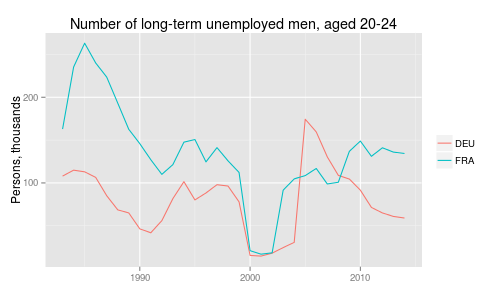
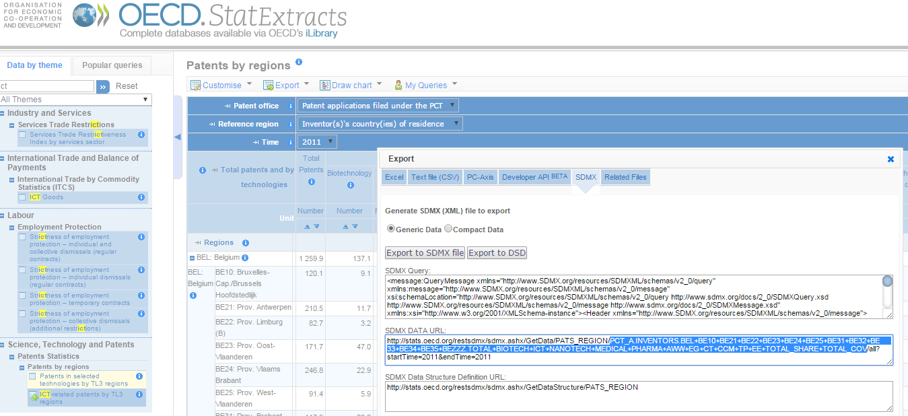

OECD - This is my edition for testing purposes only
====

[](http://cran.r-project.org/web/packages/OECD) [](https://travis-ci.org/expersso/OECD) [](https://codecov.io/github/expersso/OECD?branch=master) [](http://cran.r-project.org/web/packages/OECD)

### Introduction

The `OECD` package allows the user to download data from the OECD's API in a dynamic and reproducible way.

The package can be installed from either CRAN or Github (development version):

``` r
# from CRAN
install.packages("OECD")

# from Github
library(devtools)
install_github("expersso/OECD")

library(OECD)
```

### How to use the package

Unless you know the exact code of the series you're looking for, the best way to start is by downloading a dataframe with all the available datasets and their descriptions, and then run searches on it. The search string can be a regular expression and is case-insensitive by default.

``` r
dataset_list <- get_datasets()
search_dataset("unemployment", data = dataset_list)
```

``` r
id                title
AVD_DUR           Average duration of unemployment
AEO2012_CH6_FIG19 Figure 19: The trade off between vulnerable employment...
AEO2012_CH6_FIG29 Figure 29: Youth employment and unemployment by education...
AEO2012_CH6_FIG4  Figure 4: Youth and adult unemployment
DUR_I             Incidence of unemployment by duration
DUR_D             Unemployment by duration
```

In the following we'll explore the `DUR_D` data set, which contains data on the duration of unemployment.

``` r
dataset <- "DUR_D"
```

Before downloading the series we are interested in, it is often prudent to look at the data structure, to see what type of breakdowns the data set offers:

``` r
dstruc <- get_data_structure(dataset)
str(dstruc, max.level = 1)
```

    ## List of 12
    ##  $ VAR_DESC       :'data.frame': 12 obs. of  2 variables:
    ##  $ COUNTRY        :'data.frame': 53 obs. of  2 variables:
    ##  $ TIME           :'data.frame': 47 obs. of  2 variables:
    ##  $ SEX            :'data.frame': 3 obs. of  2 variables:
    ##  $ AGE            :'data.frame': 6 obs. of  2 variables:
    ##  $ DURATION       :'data.frame': 8 obs. of  2 variables:
    ##  $ FREQUENCY      :'data.frame': 1 obs. of  2 variables:
    ##  $ OBS_STATUS     :'data.frame': 14 obs. of  2 variables:
    ##  $ UNIT           :'data.frame': 295 obs. of  2 variables:
    ##  $ POWERCODE      :'data.frame': 32 obs. of  2 variables:
    ##  $ REFERENCEPERIOD:'data.frame': 68 obs. of  2 variables:
    ##  $ TIME_FORMAT    :'data.frame': 5 obs. of  2 variables:

The `get_data_structure` function returns a list of dataframes with human-readable values for variable names and values. The first data frame contains the variable names and shows the dimensions of a dataset:

``` r
dstruc$VAR_DESC
```

    ##                 id        description
    ## 1          COUNTRY            Country
    ## 2             TIME               Time
    ## 3              SEX                Sex
    ## 4              AGE                Age
    ## 5         DURATION           Duration
    ## 6        FREQUENCY          Frequency
    ## 7        OBS_VALUE  Observation Value
    ## 8      TIME_FORMAT        Time Format
    ## 9       OBS_STATUS Observation Status
    ## 10            UNIT               Unit
    ## 11       POWERCODE    Unit multiplier
    ## 12 REFERENCEPERIOD   Reference Period

It is often easiest not to specify any filters at this point, but rather download the entire dataset and then filter it with native `R` functions. However, sometimes the dataset is very large, so filtering it before download will cut down on download time. To illustrate, let's find out the available filters for the variables `SEX` and `AGE`:

``` r
dstruc$SEX
```

    ##      id       label
    ## 1    MW All persons
    ## 2   MEN         Men
    ## 3 WOMEN       Women

``` r
dstruc$AGE
```

    ##       id    label
    ## 1   1519 15 to 19
    ## 2   1524 15 to 24
    ## 3   2024 20 to 24
    ## 4   2554 25 to 54
    ## 5   5599      55+
    ## 6 900000    Total

Let's say we're only interested in the duration of unemployment of men aged 20 to 24 in Germany and France. We provide these filters in the form of a list to the `filter` argument of the `get_dataset` function:

``` r
filter_list <- list(c("DEU", "FRA"), "MW", "2024")
df <- get_dataset(dataset = dataset, filter = filter_list)
head(df)
```

    ##   COUNTRY SEX  AGE DURATION FREQUENCY attrs.df obsTime obsValue
    ## 1     DEU  MW 2024       UN         A      P1Y    1983    321.2
    ## 2     DEU  MW 2024       UN         A      P1Y    1984    332.9
    ## 3     DEU  MW 2024       UN         A      P1Y    1985    333.9
    ## 4     DEU  MW 2024       UN         A      P1Y    1986    311.7
    ## 5     DEU  MW 2024       UN         A      P1Y    1987    291.2
    ## 6     DEU  MW 2024       UN         A      P1Y    1988    264.8

Let's say we're only interested in long-term unemployment. We can then first look at the variable `DURATION` to find the different levels, then go back to our list of variable descriptions to learn what they mean:

``` r
unique(df$DURATION)
```

    ## [1] "UN"  "UN1" "UN2" "UN3" "UN4" "UN5" "UND" "UNK"

``` r
dstruc$DURATION
```

    ##    id                    label
    ## 1 UN1                < 1 month
    ## 2 UN2 > 1 month and < 3 months
    ## 3 UN3 > 3 month and < 6 months
    ## 4 UN4   > 6 month and < 1 year
    ## 5 UN5          1 year and over
    ## 6  UN                    Total
    ## 7 UND           Total Declared
    ## 8 UNK                  Unknown

We could of course merge the two data structures, but working with the mnemonic labels usually saves you quite a bit of typing in the long run.

### Plotting the results

We can now subset to only those unemployed for a year or more, and finally produce a plot.

``` r
df_plot <- df[df$DURATION == "UN5", ]
df_plot$obsTime <- as.numeric(df_plot$obsTime)

library(ggplot2)

qplot(data = df_plot, x = obsTime, y = obsValue, color = COUNTRY, geom = "line") +
  labs(x = NULL, y = "Persons, thousands", color = NULL,
       title = "Number of long-term unemployed men, aged 20-24")
```



If we want more in-depth information about a dataset (e.g. methodology, exact definitions of variables, etc), `browse_metadata` opens up a web browser with the metadata for the requested series.

``` r
browse_metadata(dataset)
```

### Alternative data-acquisition strategy

If one does not know exactly what data one is looking for, or if a data set contains e.g. a large number of breakdowns, it is often easier to first explore the data on the [OECD stats website](http://stats.oecd.org) and then use the `oecd` package to make the data acquisition programmatic and reproducible. The workflow would then be as follows:

1.  Find the data set and apply relevant filters on the OECD website.
2.  Select "Export -\> SDMX (XML)"
3.  Copy the generated filter expression (which follows directly after the data set name, see screenshot below).
4.  Insert this expression as the value to the `filter` argument of the `get_dataset` function and set the `pre_formatted` argument to `TRUE`.

``` r
df <- get_dataset("PATS_REGION",
                  filter = "PCT_A.INVENTORS.BEL+BE10.TOTAL+BIOTECH", 
                  pre_formatted = TRUE)
head(df)
```

    ##   KINDPATENT KINDREGION REGIONS  TECHNO TIME_FORMAT UNIT POWERCODE obsTime
    ## 1      PCT_A  INVENTORS    BE10 BIOTECH         P1Y  NBR         0    1977
    ## 2      PCT_A  INVENTORS    BE10 BIOTECH         P1Y  NBR         0    1978
    ## 3      PCT_A  INVENTORS    BE10 BIOTECH         P1Y  NBR         0    1979
    ## 4      PCT_A  INVENTORS    BE10 BIOTECH         P1Y  NBR         0    1980
    ## 5      PCT_A  INVENTORS    BE10 BIOTECH         P1Y  NBR         0    1981
    ## 6      PCT_A  INVENTORS    BE10 BIOTECH         P1Y  NBR         0    1982
    ##   obsValue
    ## 1        0
    ## 2        0
    ## 3        0
    ## 4        0
    ## 5        0
    ## 6        1



### Other information

The OECD API is currently a beta version and ["and in preparation for the full release, the structure and content of datasets are being reviewed and are likely to evolve"](http://stats.oecd.org/OpenDataAPI/index.htm). As a result, the `OECD` package may break from time to time, as I update it to incorporate changes to the API. If you notice a bug (or if you have suggestions for improvements), please don't hesitate to contact me or send a pull request.

This package is in no way officially related to or endorsed by the OECD.
