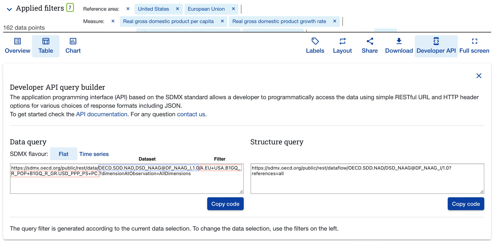

# OECD

[](http://cran.r-project.org/web/packages/OECD)
[](https://travis-ci.org/expersso/OECD)
[](https://codecov.io/github/expersso/OECD?branch=master)
[](http://cran.r-project.org/web/packages/OECD)

### Introduction

The `OECD` package allows the user to download data from the OECD’s API
in a dynamic and reproducible way.

The package can be installed from either CRAN or Github (development
version):

``` r
# from CRAN
install.packages("OECD")

# from Github
library(devtools)
install_github("expersso/OECD")

library(OECD)
```

### How to use the package

The best way to use the package is to use the [OECD Data
Explorer](https://data-explorer.oecd.org) to both browse available
datasets and filter specific datasets.

In this example we will use data National Accounts at a Glance Chapter
1: GDP:


After filtering the data using the in-browser data explorer, click the
“Developer API” button as seen in the screenshot below.



We extract the first string (respresenting the dataset as a whole) and
the second string (representing the filter we’ve applied):

``` r
dataset <- "OECD.SDD.NAD,DSD_NAAG@DF_NAAG_I"
filter <- "A.USA+EU.B1GQ_R_POP+B1GQ_R_GR.USD_PPP_PS+PC."
```

We then use the `get_dataset` function to retrieve the data:

``` r
df <- get_dataset(dataset, filter)
head(df)
```

      ACCOUNTING_ENTRY ADJUSTMENT CHAPTER CONF_STATUS CONSOLIDATION
    1                B          N  NAAG_I           F            _Z
    2                B          N  NAAG_I           F            _Z
    3                B          N  NAAG_I           F            _Z
    4                B          N  NAAG_I           F            _Z
    5                B          N  NAAG_I           F            _Z
    6                B          N  NAAG_I           F            _Z
      COUNTERPART_AREA COUNTERPART_SECTOR CURRENCY DECIMALS FREQ INSTR_ASSET
    1                D                 S1       _Z        2    A          _Z
    2                D                 S1       _Z        2    A          _Z
    3                D                 S1       _Z        2    A          _Z
    4                D                 S1       _Z        2    A          _Z
    5                D                 S1       _Z        2    A          _Z
    6                D                 S1       _Z        2    A          _Z
        MEASURE OBS_STATUS         ObsValue PRICE_BASE REF_AREA REF_YEAR_PRICE
    1 B1GQ_R_GR          A 1.76202213801051          L       EU           <NA>
    2 B1GQ_R_GR          A 2.65890962083748          L       EU           <NA>
    3 B1GQ_R_GR          A 3.00387127627695          L       EU           <NA>
    4 B1GQ_R_GR          A 2.94990334327997          L       EU           <NA>
    5 B1GQ_R_GR          A 3.86436536858204          L       EU           <NA>
    6 B1GQ_R_GR          A 2.13343923659157          L       EU           <NA>
      SECTOR TIME_PERIOD TRANSACTION TRANSFORMATION UNIT_MEASURE UNIT_MULT
    1     S1        1996        B1GQ             G1           PC         0
    2     S1        1997        B1GQ             G1           PC         0
    3     S1        1998        B1GQ             G1           PC         0
    4     S1        1999        B1GQ             G1           PC         0
    5     S1        2000        B1GQ             G1           PC         0
    6     S1        2001        B1GQ             G1           PC         0

We select the relevant variables:

``` r
df <- df |>
  subset(select = c(REF_AREA, MEASURE, UNIT_MEASURE, TIME_PERIOD, ObsValue)) |>
  transform(
    ObsValue = as.numeric(ObsValue),
    TIME_PERIOD = as.numeric(TIME_PERIOD)
  )

names(df) <- tolower(names(df))

head(df)
```

      ref_area   measure unit_measure time_period obsvalue
    1       EU B1GQ_R_GR           PC        1996 1.762022
    2       EU B1GQ_R_GR           PC        1997 2.658910
    3       EU B1GQ_R_GR           PC        1998 3.003871
    4       EU B1GQ_R_GR           PC        1999 2.949903
    5       EU B1GQ_R_GR           PC        2000 3.864365
    6       EU B1GQ_R_GR           PC        2001 2.133439

It’s not immediately clear what the values of the variables `measure`
and `unit_measure` represent, so we fetch a data dictionary and join in
to the dataset:

``` r
data_structure <- get_data_structure(dataset)
str(data_structure, max.level = 1)
```

    List of 26
     $ VAR_DESC           :'data.frame':    32 obs. of  2 variables:
     $ CL_ACCOUNTING_ENTRY:'data.frame':    11 obs. of  2 variables:
     $ CL_ACTIVITY_ISIC4  :'data.frame':    958 obs. of  2 variables:
     $ CL_ADJUSTMENT      :'data.frame':    17 obs. of  2 variables:
     $ CL_AREA            :'data.frame':    469 obs. of  2 variables:
     $ CL_COICOP_99       :'data.frame':    500 obs. of  2 variables:
     $ CL_CURRENCY        :'data.frame':    238 obs. of  2 variables:
     $ CL_PRICES          :'data.frame':    14 obs. of  2 variables:
     $ CL_PRODUCT_CPA2008 :'data.frame':    616 obs. of  2 variables:
     $ CL_SECTOR          :'data.frame':    213 obs. of  2 variables:
     $ CL_TRANSFORMATION  :'data.frame':    59 obs. of  2 variables:
     $ CL_UNIT_MEASURE    :'data.frame':    867 obs. of  2 variables:
     $ CL_CHAPTER         :'data.frame':    11 obs. of  2 variables:
     $ CL_CONSOLIDAT      :'data.frame':    7 obs. of  2 variables:
     $ CL_INSTR_ASSET     :'data.frame':    184 obs. of  2 variables:
     $ CL_MATURITY        :'data.frame':    70 obs. of  2 variables:
     $ CL_MEASURE_NA_DASH :'data.frame':    224 obs. of  2 variables:
     $ CL_PENS_FUNDTYPE   :'data.frame':    23 obs. of  2 variables:
     $ CL_TABLEID         :'data.frame':    80 obs. of  2 variables:
     $ CL_TRANSACTION     :'data.frame':    308 obs. of  2 variables:
     $ CL_VALUATION       :'data.frame':    19 obs. of  2 variables:
     $ CL_CONF_STATUS     :'data.frame':    11 obs. of  2 variables:
     $ CL_DECIMALS        :'data.frame':    16 obs. of  2 variables:
     $ CL_FREQ            :'data.frame':    34 obs. of  2 variables:
     $ CL_OBS_STATUS      :'data.frame':    20 obs. of  4 variables:
     $ CL_UNIT_MULT       :'data.frame':    31 obs. of  4 variables:

``` r
names(data_structure$CL_MEASURE_NA_DASH) <- c("measure", "measure_lbl")
names(data_structure$CL_UNIT_MEASURE) <- c("unit_measure", "unit_measure_lbl")

df <- df |>
  merge(data_structure$CL_MEASURE_NA_DASH, by = "measure") |>
  merge(data_structure$CL_UNIT_MEASURE, by = "unit_measure")

head(df)
```

      unit_measure   measure ref_area time_period obsvalue
    1           PC B1GQ_R_GR       EU        1996 1.762022
    2           PC B1GQ_R_GR       EU        1997 2.658910
    3           PC B1GQ_R_GR       EU        1998 3.003871
    4           PC B1GQ_R_GR       EU        1999 2.949903
    5           PC B1GQ_R_GR       EU        2000 3.864365
    6           PC B1GQ_R_GR       EU        2001 2.133439
                                  measure_lbl  unit_measure_lbl
    1 Real gross domestic product growth rate Percentage change
    2 Real gross domestic product growth rate Percentage change
    3 Real gross domestic product growth rate Percentage change
    4 Real gross domestic product growth rate Percentage change
    5 Real gross domestic product growth rate Percentage change
    6 Real gross domestic product growth rate Percentage change

The `get_data_structure` function returns a list of dataframes with
human-readable values for variable names and values. The first data
frame contains the variable names and shows the dimensions of a dataset:

``` r
data_structure$VAR_DESC
```

                       id                      description
    1                FREQ         Frequency of observation
    2            REF_AREA                   Reference area
    3             MEASURE                          Measure
    4         EXPENDITURE                      Expenditure
    5            ACTIVITY                Economic activity
    6        UNIT_MEASURE                  Unit of measure
    7             CHAPTER                          Chapter
    8         TIME_PERIOD                      Time period
    9           OBS_VALUE                Observation value
    10         ADJUSTMENT                       Adjustment
    11   COUNTERPART_AREA                 Counterpart area
    12             SECTOR             Institutional sector
    13 COUNTERPART_SECTOR Counterpart institutional sector
    14      CONSOLIDATION             Consolidation status
    15   ACCOUNTING_ENTRY                 Accounting entry
    16        TRANSACTION                      Transaction
    17        INSTR_ASSET           Instruments and assets
    18           MATURITY   Original and residual maturity
    19            PRODUCT                          Product
    20   PENSION_FUNDTYPE                Pension fund type
    21     CURRENCY_DENOM         Currency of denomination
    22          VALUATION                        Valuation
    23         PRICE_BASE                       Price base
    24     TRANSFORMATION                   Transformation
    25   TABLE_IDENTIFIER                 Table identifier
    26     REF_YEAR_PRICE             Price reference year
    27           BASE_PER                      Base period
    28        CONF_STATUS           Confidentiality status
    29           DECIMALS                         Decimals
    30         OBS_STATUS               Observation status
    31          UNIT_MULT                  Unit multiplier
    32           CURRENCY                         Currency

### Other information

This package is in no way officially related to or endorsed by the OECD.
